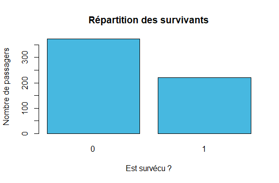
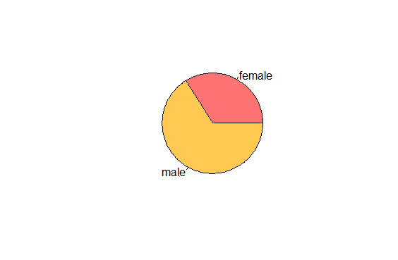
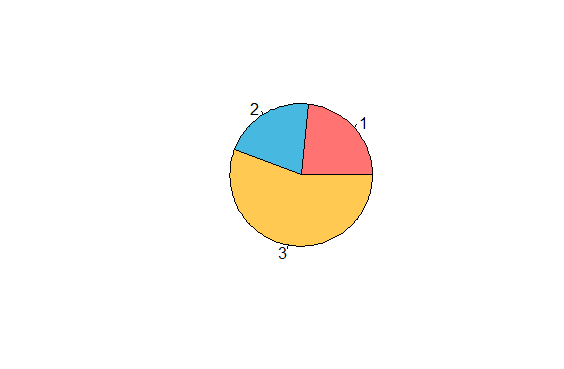
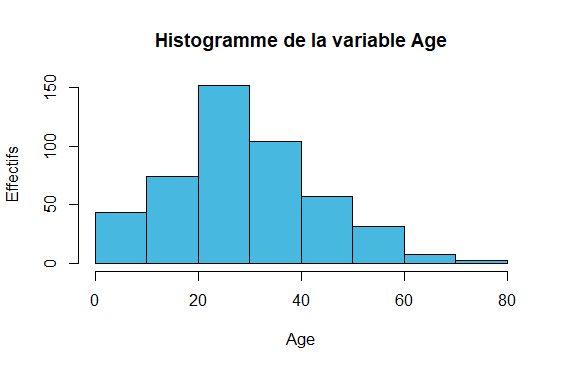
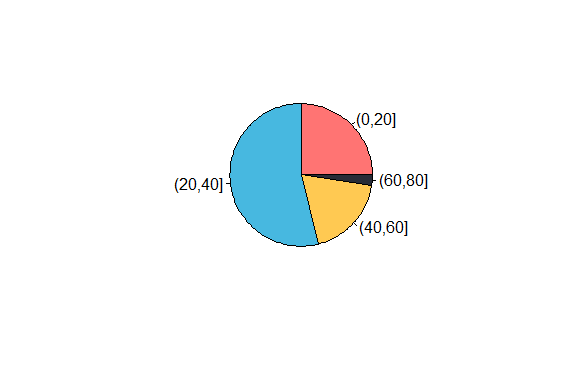
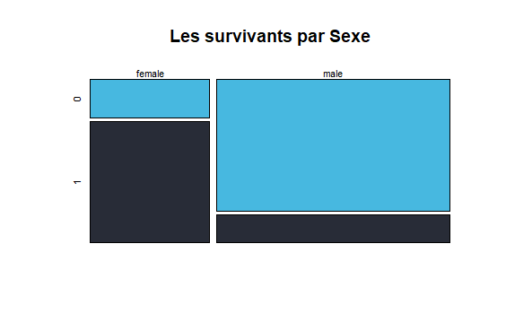
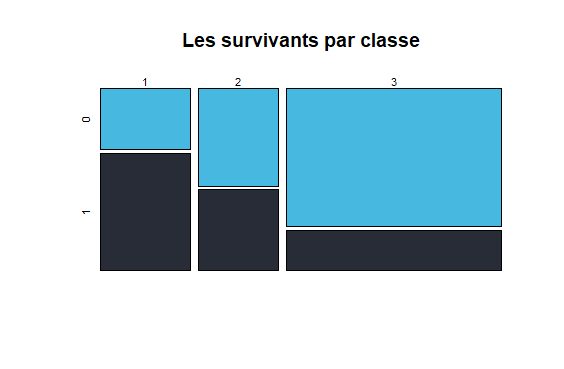
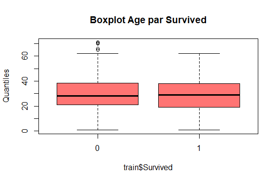
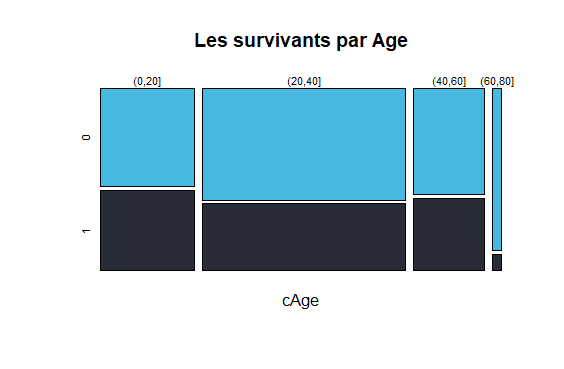

Projet avec R
=============

Q.1
---

```R
    load('REPERTOIRE_DE_TRAVAIL/titanic_train.Rdata')
```

Q.2
---

Donner le nombre d’observations 594 Observations et 12 variables

```R
    dim(train)
```

Donner le nom des variables et dire si elles sont quantitatives ou qualitatives

```R
    str(train) #Factor ou int pour les variables qualitatives / int et num pour les variables quantitatives
```

Donner le nombre de valeurs manquantes.

```R
    colSums(is.na(train))
    summary(train) #NA's est le nombre des variables manquantes
```

Quelles sont les variables avec le plus de données manquantes ?

```R
    sort(colSums(is.na(train)), decreasing = TRUE)[1:3]
```

Q.3
---

Décrire S, Sx, P et A de manière appropriée.

* S (Survived variable qualitative binaire)
  * 1 veut dire que individu est survécu **(221|37%)**
  * 2 veut dire que individu est mort **(373|63%)**

```R
    table(train$Survived)
    prop.table(table(train$Survived))
    barplot(table(train$Survived), main="Répartition des    survivants", xlab="Est survécu ?", ylab="Nombre de passagers", col=BLEU)
```



* Sx (Sex variable qualitative binaire)
  * 1 female pour les femmes **(301|34%)**
  * 2 male pour les hommes **(393|66%)**

```R
    table(train$Sex)
    prop.table(table(train$Sex))
    pie(summary(train$Sex), col = c(ROUGE, JAUNE))
```



* P (Pclass variable qualitative ordinale)
  * 1 pour la classe haute **(139|23%)**
  * 2 pour la classe moyenne **(124|21%)**
  * 3 pour la classe economique **(331|56%)**

```R
    table(train$Pclass)
    prop.table(table(train$Pclass))
    pie(table(train$Pclass), col = c(ROUGE, BLEU, JAUNE))
```



* A (Age variable quantitative continue)
  * avec **121** valeurs manquantes
  * moyenne: **29.58%**, médiane: **28**, variance: **206.29**, ecart-type: **14.36**

```R
    mean(train$Age, na.rm = T) #moyenne
    median(train$Age, na.rm = T) #médiane
    var(train$Age, na.rm = T) #variance
    sd(train$Age, na.rm = T) #écart-type
    hist(train$Age, col = BLEU, main = "Histogramme de la variable Age", ylab = "Effectifs", xlab = "Age")
```



Q.4
---

Création variable cAge quantitative à qualitative

```R
    train$cAge = cut(train$Age, breaks=c(0,20,40,60,80))
    cAge = cut(train$Age, breaks=c(0,20,40,60,80))
```

Décrire variable cAge

* cAge variable qualitative
* avec 121 valeurs manquantes
* (0,20] Age supérieur à 0 et inférieur ou égal à 20 **(118|25%)**
* (20,40] Age supérieur à 20 et inférieur ou égal à 40 **(255|54%)**
* (40,60] Age supérieur à 40 et inférieur ou égal à 60 **(89|19%)**
* (60,80] Age supérieur à 60 et inférieur ou égal à 80 **(11|2%)**

```R
    summary(cAge)
    prop.table(table(cAge))
    pie(table(cAge), col = c(ROUGE, BLEU, JAUNE, NOIR))
```



Lien entre variables quantitatives
---

Q.5
---

En utilisant les statistiques descriptives et/ou les graphiques les plus approprié pour décrire le lien Entre: 

* Gender Sx et Survived S

    ```R
        prop.table(table(train$Sex,train$Survived))
        mosaicplot(table(train$Sex,train$Survived), main = "Les survivants par Sexe", color = c(BLEU, NOIR))
    ```

    

* Pclass P et Survived S

    ```R
        prop.table(table(train$Pclass,train$Survived))
        mosaicplot(table(train$Pclass,train$Survived), main = "Les survivants par classe", color = c(BLEU, NOIR))

    ```

    

* Age A et Survived S

    ```R
        by(train[,"Age"], INDICES=train[,"Survived"], FUN=summary)
        boxplot(train$Age ~ train$Survived,
            col = ROUGE,
            main = "Boxplot Age par Survived",
            ylab = "Quantiles")

    ```

    

* cAge cA et Survived S

    ```R
        prop.table(table(cAge,train$Survived))
        mosaicplot(table(cAge,train$Survived), main = "Les survivants par Age", color = c(BLEU, NOIR))


    ```

    

Prédiction de la survie
---

Q.7
---

La probabilité de suvie par:

* Gender: **(Female=0.76) (Male=0.17)**

    ```R
        prop.table(table(train$Sex,train$Survived), margin = 1)[,2]
    ```

* Class: **(1=0.65) (2=0.45) (2=0.22)**

    ```R
        prop.table(table(train$Pclass,train$Survived), margin = 1)[,2]
    ```

* Age: **((0,20]=0.45) ((20,40]=0.37) ((40,60]=0.40) ((60,80]=0.09)**

    ```R
        prop.table(table(cAge,train$Survived), margin = 1)[,2]
    ```

Q.8
---

Construire les tables de probabilité:

* La probabilité de suvie par Gender

    ```R
        prop.table(table(train$Sex,train$Survived), margin = 1)
    ```

* La probabilité de suvie par Age

    ```R
        prop.table(table(cAge,train$Survived), margin = 1)
    ```

* La probabilité de suvie

    ```R
        prop.table(table(train$Survived))
    ```

Fonction pour la Prédiction de la survie par Gender, Class et Age
---

Q.9
---

La fonction de prédiction

```R
prob_prediction <- function(data, gender, pClass, age) {
    fAge = "(0,20]"
    if(age > 20 && age <= 40 ) {
        fAge = "(20,40]"
    } else if(age > 40 && age <= 60 ) {
        fAge = "(40,60]"
    } else if(age > 60 && age <= 80 ) {
        fAge = "(60,80]"
    }
    s_sx = prop.table(table(data$Sex,data$Survived), margin = 1)[gender,"1"]
    s_pc = prop.table(table(data$Pclass,data$Survived), margin = 1)[pClass,"1"]
    s_ca = prop.table(table(data$cAge,data$Survived), margin = 1)[fAge,"1"]
    s = prop.table(table(data$Survived))["1"]
    print(s_ca)
}

prob_prediction(train, "male", 3, 11)
```
